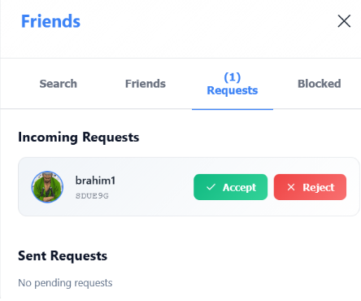
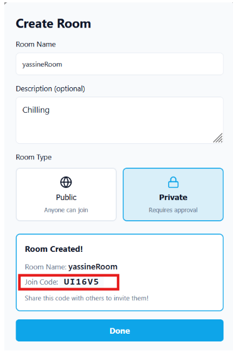
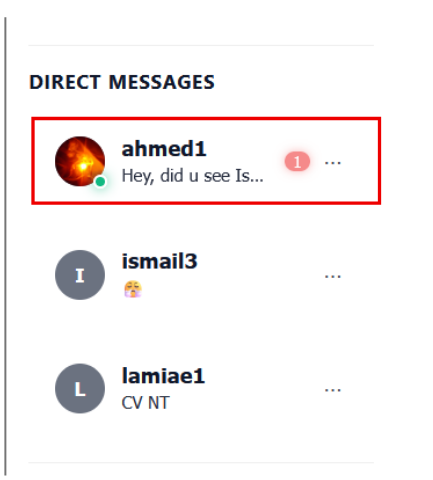
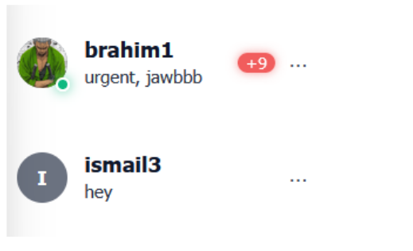
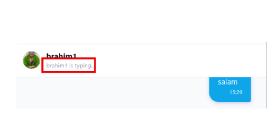
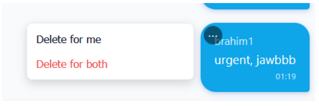
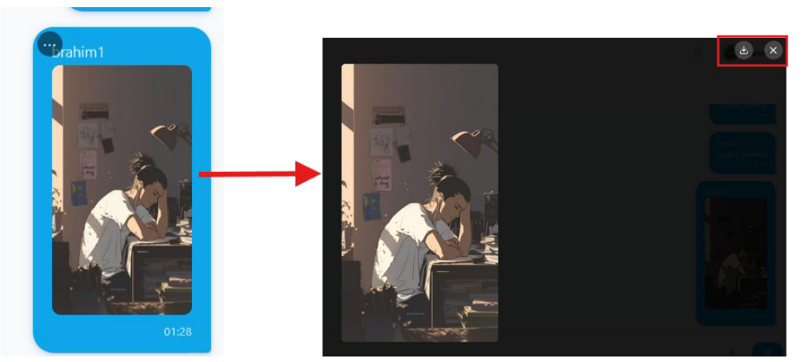
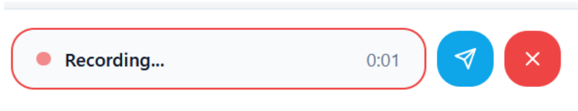
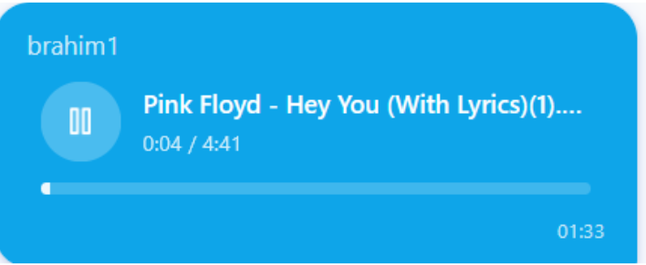
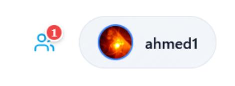

# Rapport de Projet : Heyoo - Application de Chat en Temps Réel

**Étudiants** : Ismail Bajjou & Yassine Sarih  
**Encadré par** : Pr. El Bannay  
**Date** : 30 Décembre 2025  
**Projet** : Heyoo - Application Web de Messagerie Instantanée

---

## Table des Matières

1. [Introduction](#1-introduction)
2. [Technologies Utilisées](#2-technologies-utilisées)
3. [Architecture du Système](#3-architecture-du-système)
4. [Authentification et Sécurité](#4-authentification-et-sécurité)
5. [Gestion des Utilisateurs et des Profils](#5-gestion-des-utilisateurs-et-des-profils)
6. [Système d'Amis](#6-système-damis)
7. [Gestion des Salons de Discussion (Rooms)](#7-gestion-des-salons-de-discussion-rooms)
8. [Système de Messagerie](#8-système-de-messagerie)
   - 8.1 [Messagerie de Groupe](#81-messagerie-de-groupe)
   - 8.2 [Messagerie Privée (Direct Messages)](#82-messagerie-privée-direct-messages)
9. [Fonctionnalités Avancées de Messagerie](#9-fonctionnalités-avancées-de-messagerie)
10. [Messages Multimédias et Audio](#10-messages-multimédias-et-audio)
11. [Système de Notifications](#11-système-de-notifications)
12. [Interface Utilisateur et Expérience (UI/UX)](#12-interface-utilisateur-et-expérience-uiux)
13. [Sécurité et Confidentialité des Données](#13-sécurité-et-confidentialité-des-données)
14. [Limitations du Système](#14-limitations-du-système)
15. [Perspectives et Améliorations Futures](#15-perspectives-et-améliorations-futures)
16. [Conclusion](#16-conclusion)
17. [Références](#17-références)

---

## 1. Introduction

**Heyoo** est une application web moderne de messagerie instantanée développée avec les technologies web les plus récentes. L'application permet aux utilisateurs de communiquer en temps réel via des salles de discussion publiques/privées et des messages directs.

### 1.1 Contexte du Projet

Ce projet a été réalisé dans le cadre académique pour démontrer la maîtrise des technologies web full-stack, incluant React pour le frontend, Node.js/Express pour le backend, et Socket.IO pour la communication en temps réel.

### 1.2 Objectifs

- Créer une plateforme de communication en temps réel
- Implémenter un système d'authentification sécurisé
- Développer une interface utilisateur intuitive et réactive
- Gérer plusieurs salles de discussion simultanément
- Assurer la persistance des données avec MongoDB
- Intégrer des fonctionnalités multimédias (audio, vidéo, images)

---

## 2. Technologies Utilisées

### 2.1 Frontend
| Technologie | Version | Utilisation |
|------------|---------|-------------|
| React | 18 | Framework UI principal |
| React Context API | - | Gestion d'état global |
| Socket.IO Client | 4 | Communication temps réel |
| Axios | - | Requêtes HTTP |
| Lucide React | - | Bibliothèque d'icônes |
| CSS3 | - | Styling et thèmes |

### 2.2 Backend
| Technologie | Version | Utilisation |
|------------|---------|-------------|
| Node.js | 18+ | Runtime JavaScript serveur |
| Express | 4 | Framework web |
| Socket.IO | 4 | WebSocket temps réel |
| Mongoose | 7 | ODM MongoDB |
| bcryptjs | 2 | Hashage mots de passe |
| CORS | - | Gestion cross-origin |
| dotenv | - | Variables d'environnement |

### 2.3 Base de Données
- **MongoDB** : Base de données NoSQL orientée documents
  - Collections : Users, Rooms, Messages, DirectMessages, FriendRequests
  - Indexation sur email, username, friendCode pour performances

---

## 3. Architecture du Système

### 3.1 Architecture Globale

```
┌─────────────────────────────────────────────────────────────┐
│                    Client (React)                           │
│  ┌─────────────┐  ┌──────────────┐  ┌──────────────┐      │
│  │   Header    │  │   Sidebar    │  │ ChatWindow   │      │
│  └─────────────┘  └──────────────┘  └──────────────┘      │
│                                                             │
│  Context API (ChatContext, ThemeContext)                    │
└───────────────────────────┬─────────────────────────────────┘
                            │
                   HTTP + WebSocket (Socket.IO)
                            │
┌───────────────────────────┴─────────────────────────────────┐
│                  Serveur (Express + Socket.IO)              │
│                                                             │
│  ┌──────────────┐  ┌──────────────┐  ┌──────────────┐    │
│  │  REST API    │  │  Socket.IO   │  │  Middleware  │    │
│  │  Endpoints   │  │   Events     │  │   (CORS)     │    │
│  └──────────────┘  └──────────────┘  └──────────────┘    │
└───────────────────────────┬─────────────────────────────────┘
                            │
                   Mongoose ODM
                            │
┌───────────────────────────┴─────────────────────────────────┐
│                    MongoDB Database                          │
│                                                             │
│  ┌─────────┐  ┌─────────┐  ┌─────────┐  ┌─────────┐      │
│  │  Users  │  │  Rooms  │  │Messages │  │   DMs   │      │
│  └─────────┘  └─────────┘  └─────────┘  └─────────┘      │
└─────────────────────────────────────────────────────────────┘
```

### 3.2 Flux de Communication

#### Inscription d'un Utilisateur
1. Client envoie POST `/api/auth/register` avec email, username, password
2. Serveur valide les données (email unique, mot de passe fort)
3. Hash du mot de passe avec bcrypt
4. Génération d'un UserID unique
5. Création de l'utilisateur dans MongoDB
6. Retour des informations utilisateur au client

#### Envoi d'un Message
1. Utilisateur saisit un message dans ChatWindow
2. Envoi via Socket.IO événement `send_message`
3. Serveur vérifie l'appartenance à la salle
4. Sauvegarde du message dans MongoDB
5. Broadcasting du message à tous les membres connectés
6. Réception et affichage instantané chez tous les utilisateurs

### 3.3 Structure MongoDB

**Collection Users**
```javascript
{
  _id: ObjectId,
  username: String (unique),
  email: String (unique),
  password: String (hashed),
  friendCode: String (unique, 6 chars),
  friends: [ObjectId],
  blocked: [ObjectId],
  avatar: String,
  fullName: String,
  lastSeen: Date,
  createdAt: Date
}
```

**Collection Rooms**
```javascript
{
  _id: ObjectId,
  name: String (unique),
  description: String,
  admin: ObjectId (ref: User),
  members: [ObjectId (ref: User)],
  pendingMembers: [ObjectId (ref: User)],
  type: String ('public' | 'private'),
  joinCode: String (unique, 6 chars),
  createdAt: Date
}
```

**Collection Messages**
```javascript
{
  _id: ObjectId,
  sender: ObjectId (ref: User),
  senderName: String,
  room: String,
  content: String,
  type: String ('text' | 'image' | 'file'),
  timestamp: Date
}
```

**Collection DirectMessages**
```javascript
{
  _id: ObjectId,
  sender: ObjectId (ref: User),
  receiver: ObjectId (ref: User),
  senderName: String,
  content: String,
  type: String,
  timestamp: Date,
  read: Boolean,
  hiddenFor: [ObjectId]
}
```

### 3.4 API Endpoints Principaux

**Authentification**
- `POST /api/auth/register` - Inscription
- `POST /api/auth/login` - Connexion

**Salles**
- `GET /api/rooms?userId=<id>` - Liste des salles d'un utilisateur
- `POST /api/rooms` - Créer une salle
- `DELETE /api/rooms/:name` - Supprimer une salle
- `PUT /api/rooms/:name` - Renommer une salle
- `GET /api/rooms/search?query=<text>` - Rechercher des salles
- `POST /api/rooms/join` - Rejoindre une salle
- `POST /api/rooms/:roomId/approve` - Approuver un membre (admin)

**Messages**
- `GET /api/messages/:room?userId=<id>` - Historique des messages
- `POST /api/rooms/send-message` - Envoyer un message

**Messages Directs**
- `GET /api/dm/conversations/:userId` - Liste des conversations
- `GET /api/dm/:user1/:user2` - Historique DM entre deux utilisateurs
- `POST /api/send-dm` - Envoyer un message direct
- `DELETE /api/dm/conversation/:userId/:partnerId` - Supprimer une conversation

**Amis**
- `GET /api/friends/:userId` - Liste des amis et demandes
- `POST /api/friends/request` - Envoyer une demande d'ami
- `POST /api/friends/respond` - Accepter/refuser une demande
- `POST /api/friends/block` - Bloquer un utilisateur
- `GET /api/friends/blocked/:userId` - Liste des utilisateurs bloqués

### 3.5 Socket.IO Events

**Client → Serveur**
- `user_join` - Connexion d'un utilisateur
- `join_room` - Rejoindre une salle
- `leave_room` - Quitter une salle
- `send_message` - Envoyer un message
- `send_dm` - Envoyer un message direct
- `typing` - Indicateur de frappe

**Serveur → Client**
- `connection_success` - Confirmation de connexion
- `users_online` - Liste des utilisateurs en ligne
- `receive_message` - Nouveau message reçu
- `receive_dm` - Nouveau message direct
- `user_typing` - Utilisateur en train d'écrire
- `message_error` - Erreur lors de l'envoi

---

## 4. Authentification et Sécurité


*Figure 1 : Page d'inscription*


*Figure 2 : Page de connexion*

### 4.1 Système d'Inscription

- **Validation email** : Format valide et unicité
- **Nom d'utilisateur unique** : Vérification en base de données
- **Règles de mot de passe** :
  - Minimum 8 caractères
  - Au moins 1 lettre majuscule
  - Au moins 1 chiffre
- **Indicateurs visuels** : Champs verts si valides, rouges sinon
- **Afficher/masquer** : Bouton œil pour visualiser le mot de passe

**Code - Validation mot de passe :**
```javascript
const hasLength = password.length >= 8;
const hasUpper = /[A-Z]/.test(password);
const hasNumber = /\d/.test(password);

if (!(hasLength && hasUpper && hasNumber)) {
  return res.status(400).json({ 
    error: 'password_requirements',
    detail: 'Min 8 chars, 1 uppercase, 1 number'
  });
}
```

### 4.2 Hashage des Mots de Passe

- **bcrypt** : Algorithme de hachage sécurisé
- **Salt rounds** : 10 itérations pour ralentir les attaques brute-force
- **Stockage** : Uniquement le hash est sauvegardé en base

**Code - Hashage bcrypt :**
```javascript
const hashed = await bcrypt.hash(password, 10);
const user = await User.create({ 
  email, 
  password: hashed, 
  username 
});
```

### 4.3 Système de Connexion

- **Authentification** : Par email et mot de passe
- **Vérification** : Comparaison du hash avec bcrypt.compare()
- **Session** : Stockage de l'utilisateur connecté dans localStorage
- **Mot de passe oublié** : Prévu pour implémentation future (vérification email)

### 4.4 Protection des Données

- **Validation côté serveur** : Toutes les entrées utilisateur sont validées
- **Contrôle d'accès** : Vérification de l'appartenance avant accès aux ressources
- **Prévention injection** : Utilisation de Mongoose pour protéger contre les injections NoSQL

---

## 5. Gestion des Utilisateurs et des Profils


*Figure 3 : Profil utilisateur complet*

### 5.1 Profil Utilisateur

Chaque utilisateur dispose d'un profil personnel complet :

- **Avatar** : Photo de profil personnalisable avec upload d'image
- **Informations personnelles** :
  - Nom complet
  - Adresse email
  - ID utilisateur unique
- **Bouton copie ID** : Copie rapide de l'ID avec feedback visuel (icône Check ✓)
- **Édition** : Modification des informations en ligne

### 5.2 ID Utilisateur Unique

- **Génération automatique** : Code alphanumérique de 6 caractères créé à l'inscription
- **Unicité garantie** : Vérification en base de données pour éviter les doublons
- **Utilisation** : Permet aux autres utilisateurs de trouver et ajouter des amis

**Code - Génération ID unique :**
```javascript
let friendCode;
let codeExists = true;
while (codeExists) {
  friendCode = generateFriendCode(); // 6 chars alphanumériques
  codeExists = await User.findOne({ friendCode });
}
```

### 5.3 Contrôle d'Accès

- **Restrictions** : Un utilisateur ne peut modifier que son propre profil
- **Lecture seule** : Les profils des autres utilisateurs sont visibles mais non modifiables
- **Données publiques** : Avatar, nom d'utilisateur, statut en ligne (si ami)

### 5.4 Statut en Ligne

- **Visibilité** : Uniquement pour les amis
- **Déduplication** : Un même utilisateur sur plusieurs onglets/sessions n'apparaît qu'une fois
- **Dernière connexion** : Horodatage "last seen" affiché
- **Masquage** : Caché pour les utilisateurs bloqués

---

## 6. Système d'Amis


*Figure 4 : Recherche d'amis*


*Figure 5 : Demandes d'amitié*


*Figure 6 : Amis connectés*

### 6.1 Recherche d'Amis

- **Recherche par ID** : Barre de recherche acceptant les 6 caractères
- **Insensible à la casse** : Recherche fonctionne en majuscules ou minuscules
- **Résultat instantané** : Affichage du profil trouvé
- **Bouton demande** : Envoyer une demande d'ami directement

### 6.2 Demandes d'Amitié

- **Envoi** : Demande envoyée avec notification
- **Réception** : Badge notification sur l'icône amis
- **Actions** : Accepter ✓ ou refuser ✗
- **Liste** : Demandes entrantes et sortantes visibles

### 6.3 Liste d'Amis

- **Affichage** : Tous les amis avec avatars
- **Statut en ligne** : Point vert pour amis connectés
- **Filtrage** : Section "Amis en Ligne" dédiée
- **Actions** : Cliquer pour ouvrir DM ou voir profil

**Code - Filtrage amis en ligne :**
```javascript
const friendIds = currentUser.friends.map(f => f._id);
const onlineFriends = onlineUsers.filter(u => 
  u.userId !== currentUser.id && 
  friendIds.includes(u.userId)
);
```

### 6.4 Blocage d'Utilisateurs

- **Bloquer** : Option dans le profil ou menu contextuel
- **Effets** :
  - L'utilisateur bloqué ne peut plus envoyer de messages
  - "Last seen" masqué
  - N'apparaît plus dans la liste en ligne
- **Déblocage** : Possible depuis la liste des utilisateurs bloqués

---

## 7. Gestion des Salons de Discussion (Rooms)


*Figure 7 : Modal création de salle*


*Figure 8 : Liste des salles*

### 7.1 Création de Salles

- **Nom** : Unique, obligatoire
- **Description** : Optionnelle, décrit le sujet de la salle
- **Type** :
  - **Public** : Accès instantané pour tous 🌐
  - **Privé** : Approbation admin requise 🔒
- **Code de jonction** : Généré automatiquement (6 caractères)
- **Administrateur** : Créateur de la salle

### 7.2 Types de Salles

**Salles Publiques :**
- Accès immédiat par recherche ou code

**Salles Privées :**
- Accès uniquement par invitation ou code
- Admin doit approuver les demandes

### 7.3 Gestion Administrative

**Droits admin :**
- **Renommer** : Édition inline du nom de salle
- **Supprimer** : Suppression avec confirmation (supprime aussi tous les messages)
- **Gérer membres** : Voir liste, approuver/refuser demandes

**Code - Vérification droits admin :**
```javascript
if (room.admin.toString() !== userId) {
  return res.status(403).json({ error: 'Admin only' });
}
```

### 7.4 Recherche et Jonction

- **Recherche** : Par nom de salle ou code de jonction
- **Aperçu** : Description et administrateur visibles avant de rejoindre
- **Jonction** : Instantanée (public) ou demande (privé)

---

## 8. Système de Messagerie

### 8.1 Messagerie de Groupe


*Figure 9 : Discussion dans un salon*

#### 8.1.1 Envoi de Messages

- **Temps réel** : Via Socket.IO, livraison instantanée
- **Persistance** : Sauvegarde dans MongoDB
- **Broadcasting** : Émission à tous les membres connectés
- **Types** : Texte, images, audio, vidéos, documents

**Code - Envoi message temps réel :**
```javascript
socket.on('send_message', async (data) => {
  const message = await Message.create(data);
  
  // Envoi à l'émetteur
  socket.emit('receive_message', message);
  // Broadcasting aux autres membres
  socket.to(room).emit('receive_message', message);
});
```

#### 8.1.2 Réception de Messages

- **Notifications** : Badge compteur messages non lus
- **Auto-scroll** : Défilement automatique vers le dernier message
- **Horodatage** : Heure affichée à côté de chaque message
- **Groupement** : Messages du même utilisateur regroupés visuellement

#### 8.1.3 Sécurité des Salles

- **Vérification appartenance** : Contrôle avant chaque envoi/lecture
- **Nouveau compte** : Voit les noms de salles mais pas les messages tant qu'il n'a pas rejoint
- **Protection** : Erreur 403 si tentative d'accès non autorisé

**Code - Vérification membership :**
```javascript
const roomDoc = await Room.findOne({ name: room });
if (!roomDoc.members.some(m => m.toString() === sender)) {
  return res.status(403).json({ error: 'Not a member' });
}
```

### 8.2 Messagerie Privée (Direct Messages)


*Figure 10 : Liste des conversations DM*


*Figure 11 : Conversation privée*

#### 8.2.1 Démarrage d'une Conversation

- **Clic sur ami** : Ouvre directement une conversation DM
- **Liste conversations** : Section dédiée "Direct Messages" dans la sidebar
- **Persistance** : Historique complet sauvegardé

#### 8.2.2 Envoi et Réception DM

- **Livraison bidirectionnelle** : Émetteur et destinataire reçoivent le message
- **Temps réel** : Via événements Socket.IO `send_dm` / `receive_dm`
- **Hors ligne** : Messages sauvegardés et livrés à la reconnexion

**Code - Envoi DM Socket.IO :**
```javascript
socket.on('send_dm', async (data) => {
  const dm = await DirectMessage.create(data);
  
  // Envoi aux deux utilisateurs
  receiverSockets.forEach(s => s.emit('receive_dm', dm));
  senderSockets.forEach(s => s.emit('receive_dm', dm));
});
```

#### 8.2.3 Gestion des Conversations

- **Suppression** : Deux options
  - **Pour moi** : Masque uniquement pour l'utilisateur actuel
  - **Pour tous** : Supprime de la base de données
- **Horodatage** : Heure précise affichée
- **Bulles arrondies** : Design moderne avec distinction émetteur/destinataire

---

## 9. Fonctionnalités Avancées de Messagerie


*Figure 12 : Messages non lus "+9"*


*Figure 13 : Indicateur "Typing…"*


*Figure 14 : Options suppression messages (pour moi / pour tous)*

### 9.1 Indicateur de Frappe (Typing Indicator)

- **Temps réel** : "X Typing…" affiché instantanément
- **Socket.IO** : Événement `typing` émis pendant la saisie
- **Timeout** : Disparaît automatiquement après 3 secondes d'inactivité
- **Salles et DMs** : Fonctionne dans les deux contextes

**Code - Émission événement typing :**
```javascript
const handleInputChange = (e) => {
  setMessage(e.target.value);
  socket.emit('typing', { room: currentRoom, user: currentUser.username });
};
```

### 9.2 Compteur de Messages Non Lus

- **Badge numérique** : Affiche le nombre exact jusqu'à 9
- **"+9"** : Si plus de 9 messages non lus
- **Par conversation** : Compteur séparé pour chaque salle et DM
- **Réinitialisation** : Compteur remis à zéro à l'ouverture de la conversation

### 9.3 Horodatage des Messages

- **Format** : HH:MM (ex: 14:35)
- **Affichage** : À côté de chaque message
- **Tri** : Messages triés chronologiquement

### 9.4 Last Seen (Dernière Connexion)

- **Affichage** : "Vu pour la dernière fois à HH:MM"
- **Visibilité** : Uniquement pour les amis
- **Masquage** : Caché pour utilisateurs bloqués
- **Mise à jour** : Automatique à la déconnexion

### 9.5 Suppression de Messages

**Options de suppression :**
1. **Pour moi** :
   - Message masqué uniquement pour l'utilisateur actuel
   - Reste visible pour les autres
   - Stocké dans `message.deletedFor[]`

2. **Pour tous** :
   - Message supprimé de la base de données
   - Disparaît pour tous les utilisateurs
   - Action irréversible

**Code - Suppression pour moi :**
```javascript
message.deletedFor.push(userId);
await message.save();
```

### 9.6 Gestion des Messages Bloqués

- **Envoi bloqué** : Messages d'utilisateurs bloqués ne sont pas reçus
- **Message générique** : "Échec de l'envoi" affiché (sans révéler qui a bloqué)
- **Conversations existantes** : Restent visibles mais inactives

---

## 10. Messages Multimédias et Audio


*Figure 15 : Image cliquable + bouton téléchargement*


*Figure 16 : Enregistrement audio*


*Figure 17 : Lecture MP3*

### 10.1 Sélecteur d'Emojis

- **Emoji picker** : Bibliothèque intégrée avec toutes les catégories
- **Recherche** : Barre de recherche d'emojis par mot-clé
- **Récents** : Section emojis récemment utilisés
- **Insertion** : Clic pour insérer dans le message

### 10.2 Messages Vocaux (Audio)

**Enregistrement :**
- **Bouton micro** : À côté du bouton d'envoi
- **MediaRecorder API** : Utilisation de l'API native du navigateur
- **Timer** : Durée d'enregistrement affichée en temps réel (00:15)
- **Arrêt** : Clic pour terminer l'enregistrement

**Lecture :**
- **Lecteur intégré** : Bouton play/pause
- **Barre de progression** : Visualisation de la position
- **Durée** : Temps total affiché
- **Format** : audio/webm stocké avec durée en secondes

**Code - Enregistrement audio :**
```javascript
const startRecording = async () => {
  const stream = await navigator.mediaDevices.getUserMedia({ audio: true });
  const mediaRecorder = new MediaRecorder(stream);
  
  mediaRecorder.ondataavailable = (e) => audioChunks.push(e.data);
  mediaRecorder.onstop = () => {
    const audioBlob = new Blob(audioChunks, { type: 'audio/webm' });
    sendAudioMessage(audioBlob, duration);
  };
  
  mediaRecorder.start();
};
```

### 10.3 Images

- **Upload** : Sélection via input file ou drag & drop
- **Affichage inline** : Image intégrée dans la bulle de message
- **Cliquable** : Ouverture en plein écran au clic
- **Téléchargement** : Bouton download visible
- **Formats** : JPG, PNG, GIF, WebP
- **Taille max** : 25MB par fichier

### 10.4 Vidéos

- **Lecteur HTML5** : Contrôles natifs (play, pause, volume, plein écran)
- **Thumbnail** : Miniature avant lecture
- **Formats** : MP4, WebM, OGG
- **Téléchargement** : Option disponible

### 10.5 Documents et Fichiers

- **Types supportés** : PDF, DOCX, XLSX, TXT, ZIP
- **Affichage** : Icône + nom du fichier + taille
- **Téléchargement** : Clic pour télécharger
- **Limite** : 25MB maximum

### 10.6 Lecteur MP3/Musique

- **Lecteur audio** : Pour fichiers MP3, WAV, OGG
- **Contrôles** : Play, pause, volume, barre de progression
- **Métadonnées** : Nom du fichier et durée
- **Streaming** : Pas besoin de télécharger pour écouter

---

## 11. Système de Notifications


*Figure 18 : Notifications*

### 11.1 Notifications de Messages

- **Compteur en temps réel** : Mis à jour instantanément
- **Badge rouge** : Sur chaque salle/DM avec messages non lus
- **Distinction** : Couleur différente pour salles vs DMs
- **Son** : Option notification sonore (désactivable)

### 11.2 Notifications d'Amitié

- **Demandes entrantes** : Badge sur l'icône amis
- **Compteur** : Nombre de demandes en attente
- **Acceptation** : Notification de confirmation
- **Refus** : Pas de notification envoyée

### 11.3 Notifications Socket.IO

**Événements en temps réel :**
- `receive_message` : Nouveau message reçu
- `receive_dm` : Nouveau message direct
- `friend_request` : Demande d'ami
- `friend_accepted` : Ami accepté
- `users_online` : Mise à jour liste en ligne
- `user_typing` : Utilisateur en train d'écrire

### 11.4 Persistance

- **Hors ligne** : Notifications stockées et affichées au retour
- **Synchronisation** : Compteurs mis à jour à la reconnexion
- **Historique** : Conservé dans MongoDB

---

## 12. Interface Utilisateur et Expérience (UI/UX)


*Figure 19 : Comparaison mode clair vs mode sombre (côte à côte)*

### 12.1 Thème Clair / Sombre

**Mode sombre (par défaut) :**
- Fond : #1f2937 (gris foncé)
- Texte : #f3f4f6 (blanc cassé)
- Accent : #0ea5e9 (cyan)

**Mode clair :**
- Fond : #ffffff (blanc)
- Texte : #111827 (noir)
- Accent : #0ea5e9 (conservé)

**Persistance :** Choix sauvegardé dans localStorage

**Code - Toggle thème :**
```javascript
const toggleTheme = () => {
  setTheme(prev => {
    const next = prev === 'dark' ? 'light' : 'dark';
    localStorage.setItem('chat_theme', next);
    return next;
  });
};
```

### 12.2 Branding Heyoo

- **Logo** : 💬 emoji avec texte "Heyoo"
- **Gradient** : Cyan (#0ea5e9) → Bleu (#0284c7)
- **Ombre portée** : Drop shadow pour profondeur
- **Animations** : Hover effects sur le logo

### 12.3 Bulles de Messages

- **Design arrondi** : `border-radius: 18px`
- **Distinction** :
  - Émetteur : Aligné à droite, bleu
  - Destinataire : Aligné à gauche, gris
- **Animations** : Élévation au survol (`box-shadow`)
- **Padding** : Espacement optimisé pour lisibilité
- **Long texte** : Reste dans la bulle (pas de débordement)

### 12.4 Zone de Saisie

- **Input arrondi** : Design moderne avec focus cyan
- **Boutons** :
  - Emoji picker 😊
  - Micro 🎤
  - Envoi ➤ (avec effet lumineux au hover)
- **Placeholder** : "Écrivez un message…"

### 12.5 Sidebar Rétractable

- **Toggle button** : À gauche du logo
- **Animations** : Transition fluide (`transform: translateX`)
- **Responsive** : Auto-collapse sur mobile
- **Icône** : Hamburger menu ☰

### 12.6 Design Responsive

**Desktop (>1024px) :**
- 3 colonnes : Sidebar | Chat | (optionnel) Details
- Sidebar toujours visible

**Tablette (768-1024px) :**
- 2 colonnes : Sidebar | Chat
- Sidebar collapsible

**Mobile (<768px) :**
- 1 colonne : Chat en plein écran
- Sidebar overlay au besoin

### 12.7 Animations et Transitions

- **Messages** : Fade-in à l'apparition
- **Hover** : Lift effect (élévation)
- **Loading** : Spinner avec barre de progression
- **Navigation** : Smooth scroll automatique
- **Transitions** : 200-300ms pour fluidité

### 12.8 Écran de Bienvenue

Pour nouveaux utilisateurs sans salle/DM sélectionné :

```
💬
Bienvenue sur Heyoo
Rejoignez une salle ou démarrez une conversation avec un ami.
```

---

## 13. Sécurité et Confidentialité des Données

### 13.1 Hashage des Mots de Passe

- **bcrypt** : Algorithme éprouvé (salt + hash)
- **Rounds** : 10 itérations (équilibre sécurité/performance)
- **Stockage** : Uniquement le hash (jamais le mot de passe en clair)
- **Comparaison** : Via `bcrypt.compare()` lors de la connexion

### 13.2 Validation des Entrées

**Côté serveur :**
- Email : Format valide + unicité
- Username : Non vide + unicité
- Mot de passe : Règles strictes (≥8 chars, majuscule, chiffre)
- Nom de salle : Non vide + pas de doublons

**Prévention injections :**
- Mongoose ODM protège contre les injections NoSQL
- Validation des types de données
- Sanitization des inputs utilisateur

### 13.3 Contrôle d'Accès

**Appartenance aux salles :**
- Vérification avant chaque lecture/écriture
- Erreur 403 si non-membre
- Auto-ajout désactivé (sécurité renforcée)

**Profils utilisateurs :**
- Lecture seule pour autres utilisateurs
- Édition limitée à son propre profil
- Suppression protégée par confirmation

### 13.4 Protection des Données Sensibles

- **Mots de passe** : Hashés avec bcrypt
- **Sessions** : localStorage côté client (limité)
- **CORS** : Configuration stricte (CLIENT_ORIGIN)

### 13.5 Confidentialité

**Statut en ligne :**
- Visible uniquement pour les amis
- Caché pour utilisateurs bloqués

**Messages bloqués :**
- Message générique affiché
- Identité du bloqueur non révélée

**Suppression :**
- Option "pour moi" préserve confidentialité
- "Pour tous" supprime définitivement

---

## 14. Limitations du Système

### 14.1 Limitations Actuelles

**Authentification :**
- Réinitialisation mot de passe non implémentée (email verification manquante)
- Pas de connexion OAuth (Google, Facebook)

**Fonctionnalités :**
- Système d'invitation aux salles non complet
- Pas d'appels audio/vidéo en temps réel
- Pas de partage d'écran

**Fichiers :**
- Limite 25MB par fichier
- Pas de compression automatique

**Sécurité :**
- Pas de chiffrement end-to-end
- Pas d'authentification à deux facteurs (2FA)
- Sessions non expirables

**Performance :**
- Pas de pagination des messages (charge tous les messages)
- Pas de lazy loading des images

### 14.2 Contraintes Techniques

- **Stockage fichiers** : Base64 augmente la taille DB
- **WebSocket** : Nécessite connexion persistante
- **Browser support** : MediaRecorder API non supporté sur tous les navigateurs

---

## 15. Perspectives et Améliorations Futures

**Sécurité :**
- ✅ Ajouter vérification email (reset password)
- ✅ Authentification à deux facteurs (2FA)

**Notifications :**
- Notifications push navigateur
- Sons personnalisables

**Fonctionnalités :**
- Appels audio/vidéo WebRTC
- ✅ Réactions aux messages (👍❤️😂)
- Épingler messages importants

**Collaboration :**
- Rôles dans les salles (admin, modérateur, membre)

---

## 16. Conclusion

### 16.1 Synthèse du Projet

Ce projet a permis de développer **Heyoo**, une application web de messagerie en temps réel complète et moderne, utilisant les technologies les plus récentes du développement web full-stack.

**Réalisations principales :**
- ✅ Application de chat fonctionnelle en temps réel
- ✅ Système d'authentification sécurisé avec bcrypt
- ✅ Gestion complète des salles publiques et privées
- ✅ Messagerie directe entre utilisateurs
- ✅ Système d'amis avec recherche par ID unique
- ✅ Support multimédias (audio, vidéo, images, documents)
- ✅ Interface utilisateur moderne et responsive
- ✅ Thème clair/sombre avec persistance
- ✅ Notifications en temps réel
- ✅ Sécurité renforcée (vérification d'appartenance, contrôle d'accès)

### 16.2 Compétences Développées

**Ismail Bajjou & Yassine Sarih**

**Frontend :**
- Maîtrise de React 18 et des hooks (useState, useEffect, useContext)
- Gestion d'état global avec Context API
- Communication WebSocket en temps réel (Socket.IO Client)
- Interfaces responsives et accessibles
- Gestion de thèmes dynamiques (clair/sombre)
- Manipulation de médias (audio via MediaRecorder API, images, vidéos)
- Animations et transitions CSS avancées

**Backend :**
- Développement API REST avec Express.js
- Implémentation WebSocket avec Socket.IO
- Sécurisation (bcrypt, validation, vérification d'appartenance)
- Modélisation de données NoSQL (MongoDB/Mongoose)
- Gestion d'événements asynchrones
- Broadcasting temps réel à plusieurs clients

**Sécurité :**
- Hashage de mots de passe avec bcrypt
- Validation côté serveur stricte
- Contrôle d'accès aux ressources
- Protection contre les injections NoSQL

### 16.3 Apport Pédagogique

Ce projet a consolidé notre compréhension de :
- L'architecture client-serveur moderne
- Les protocoles HTTP et WebSocket
- La persistance des données avec bases NoSQL
- La sécurité des applications web
- L'expérience utilisateur (UX) et l'accessibilité
- Le travail en collaboration sur un projet complet

---

## 17. Références

### 17.1 Technologies Principales

**Frontend Framework**
- React 18 - Bibliothèque JavaScript pour interfaces utilisateur
- Socket.IO Client - Communication WebSocket bidirectionnelle
- Axios - Client HTTP moderne
- Lucide React - Bibliothèque d'icônes SVG
- CSS3 - Styling avancé et animations

**Backend Framework**
- Node.js - Runtime JavaScript côté serveur
- Express - Framework web minimaliste
- Socket.IO - Protocole WebSocket avec fallbacks
- Mongoose - ODM pour MongoDB
- bcryptjs - Hachage sécurisé de mots de passe

**Base de Données**
- MongoDB - Base de données NoSQL orientée documents

### 17.2 Inspirations et Références

**Applications de Chat Similaires**
- Discord - Architecture temps réel, salles, DMs
- WhatsApp Web - UX chat mobile/web
- Telegram - Sécurité, DMs, salles publiques

**Tutoriels et Ressources**
- Socket.IO Events Guide
- React Hooks Documentation
- Express.js Best Practices
- MongoDB Schema Design
- Web Audio API

### 17.3 Outils de Développement Utilisés

**IDE & Éditeurs**
- Visual Studio Code - Éditeur de texte
- Postman - Test des API REST

**Package Managers**
- npm - Gestionnaire de paquets Node.js

**Développement Local**
- MongoDB Community Server - Base de données locale
- MongoDB Compass - Gestionnaire GUI MongoDB

### 17.4 Documentation Officielle

- MDN Web Docs - Référence web complets
- ES6/ES2020 Features - JavaScript moderne
- REST API Best Practices - Conventions API
- CORS Documentation - Cross-Origin Resource Sharing

---

**Fin du Rapport Heyoo - Application de Chat en Temps Réel**  
*Ismail Bajjou & Yassine Sarih – 30 Décembre 2025*
