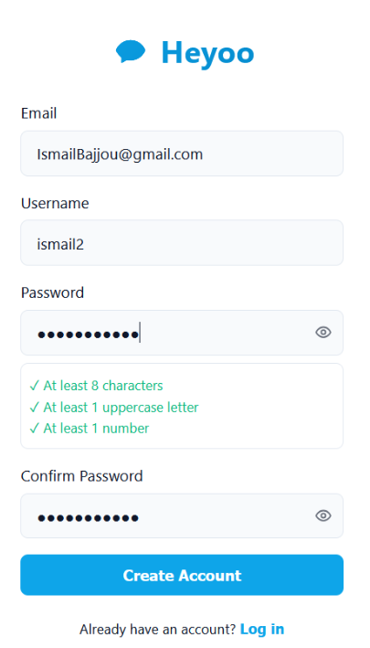
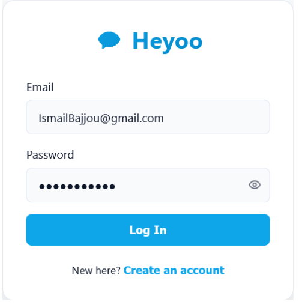
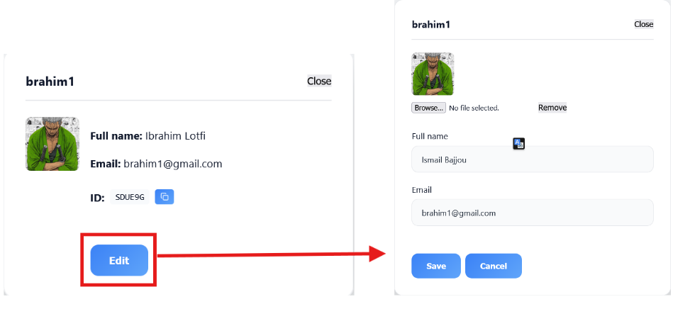
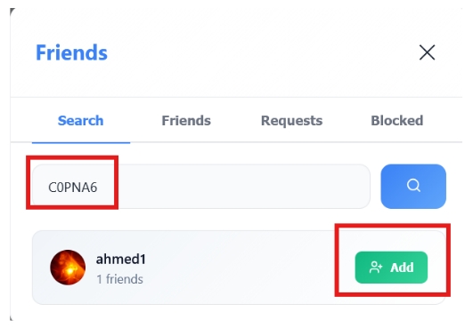
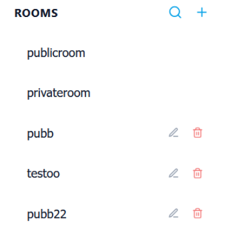
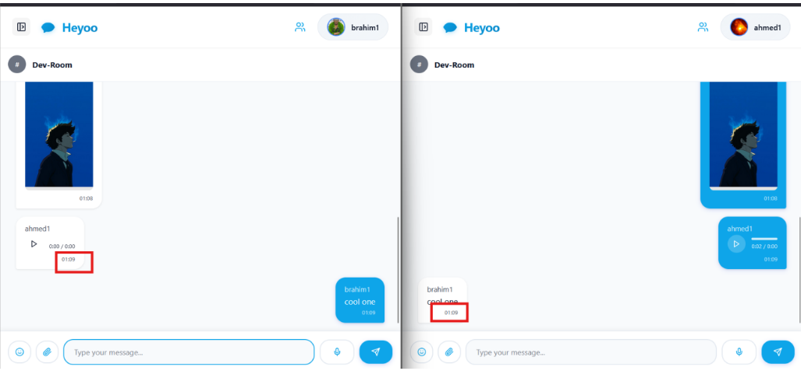
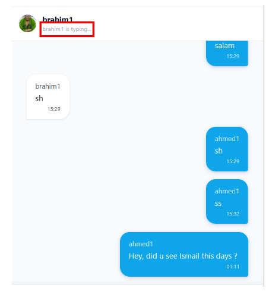
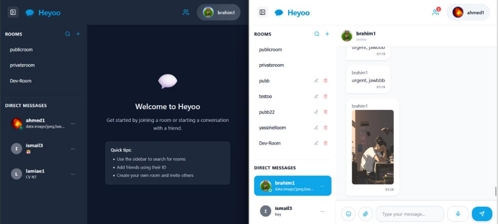

# 💬 Heyoo — Real-Time Chat Application

[](https://react.dev/)
[](https://nodejs.org/)
[](https://www.mongodb.com/)
[](https://socket.io/)
[](LICENSE)

A modern, full-stack real-time chat application built with **React**, **Express**, **Socket.IO**, and **MongoDB**. Features instant messaging, room management, direct messages, friend system, and theme support.

**👥 Built by**: Ismail Bajjou & Yassine Sarih  
**📖 [Full Documentation](RAPPORT_PROJET.md)** — Comprehensive technical report with architecture, security, and features

---

## ✨ Features

### 🔐 Authentication & Security
- Secure user registration with email validation
- Password hashing with bcrypt (10 rounds)
- Session management via localStorage
- Input validation & NoSQL injection prevention

### 💬 Real-Time Messaging
- **Group Rooms** — Public and private room support
- **Direct Messages** — One-to-one conversations
- **Typing Indicators** — See when users are typing
- **Message History** — Full conversation persistence
- **Multimedia Support** — Images, audio, video, documents

### 👥 Friend System
- Add friends by unique ID (6-char code)
- Friend requests with approval system
- Online status indicator
- Block/unblock users
- Last seen timestamps

### 🏠 Room Management
- Create public/private rooms
- Admin controls (rename, delete, manage members)
- Join codes for easy sharing
- Pending member approvals
- Room search & discovery

### 🎨 User Experience
- **Light/Dark Theme** — Toggle with persistence
- **Responsive Design** — Desktop, tablet, mobile
- **Unread Badges** — Message counters (up to +9)
- **Modern UI** — Smooth animations, clean design
- **Welcome Screen** — Guided onboarding

---

## 🛠 Tech Stack

| Layer | Technology | Version |
|-------|-----------|---------|
| **Frontend** | React | 18 |
| **Real-Time** | Socket.IO Client | 4 |
| **HTTP Client** | Axios | Latest |
| **Icons** | Lucide React | Latest |
| **Backend** | Express.js | 4 |
| **WebSocket** | Socket.IO | 4 |
| **Database** | MongoDB + Mongoose | 7 |
| **Security** | bcryptjs | 2 |
| **CORS** | cors | Latest |

---

## 📦 Installation

### Prerequisites
- **Node.js** 18+ ([download](https://nodejs.org/))
- **MongoDB** running locally ([install](https://www.mongodb.com/try/download/community))
- **npm** or yarn
- **Windows/Mac/Linux**

### Quick Start (Windows)

1. **Clone the repository**
```bash
git clone https://github.com/Ismail-Bajjou/heyoo-chat.git
cd heyoo-chat
```

2. **Double-click `start.bat`** to launch everything
   - Server runs on `http://localhost:5000`
   - Client runs on `http://localhost:3000`

### Manual Setup

#### Server
```bash
cd server
npm install
npm run dev
```

**Optional `.env` file** (defaults work fine):
```env
MONGODB_URI=mongodb://localhost:27017/chatapp
CLIENT_ORIGIN=http://localhost:3000
PORT=5000
```

#### Client (New Terminal)
```bash
cd client
npm install
npm start
```

---

## 📁 Project Structure

```
heyoo-chat/
├── server/                 # Express + Socket.IO backend
│   ├── server.js          # API routes & Socket.IO events
│   ├── package.json       # Dependencies & scripts
│   └── models/            # (Future) MongoDB schemas
│
├── client/                # React frontend
│   ├── public/
│   │   └── index.html     # App shell
│   ├── src/
│   │   ├── App.js         # Main app component
│   │   ├── api.js         # API configuration
│   │   ├── context/       # Global state (Chat, Theme)
│   │   ├── components/    # UI components
│   │   ├── pages/         # Login & auth pages
│   │   └── styles/        # CSS (light/dark themes)
│   └── package.json
│
├── figures/               # Documentation images
├── RAPPORT_PROJET.md      # Full technical documentation
├── README.md              # This file
├── .gitignore
└── start.bat              # Windows launcher
```

---

## 🚀 Usage

### Register & Login
1. Click **Register** on the login page
2. Enter email, username, password (min 8 chars, 1 uppercase, 1 number)
3. You get a unique 6-character friend ID automatically

### Create a Room
1. Click **"+"** in the sidebar
2. Enter room name & description
3. Choose **Public** (instant join) or **Private** (admin approval)
4. Share the join code with others

### Send Messages
1. Select a room or friend
2. Type your message
3. Click **Send** or press Enter
4. Messages appear in real-time for all members

### Add Friends
1. Open **Friends** tab
2. Search by friend ID
3. Send request → they approve → added as friend
4. Click to open direct message

### Upload Media
- **Images**: Click attachment icon or drag & drop
- **Audio**: Click mic icon to record voice message
- **Documents**: PDF, Word, Excel, ZIP (max 25MB)

---

## 🔐 Security Features

✅ **Passwords**: Hashed with bcrypt (never stored in plain text)  
✅ **Access Control**: Room membership verified before read/write  
✅ **Private Rooms**: Admin approval required  
✅ **Blocked Users**: Messages from blocked users rejected  
✅ **Input Validation**: Server-side validation + Mongoose ODM protection  
✅ **CORS**: Restricted to client origin  

---

## 📚 API Endpoints

### Authentication
- `POST /api/auth/register` — Create account
- `POST /api/auth/login` — Login (future)

### Rooms
- `GET /api/rooms?userId=<id>` — List user rooms
- `POST /api/rooms` — Create room
- `POST /api/rooms/join` — Join room
- `DELETE /api/rooms/:name` — Delete room (admin)
- `PUT /api/rooms/:name` — Rename room (admin)
- `GET /api/rooms/search?query=<text>` — Search rooms

### Messages
- `GET /api/messages/:room?userId=<id>` — Get room messages
- `POST /api/rooms/send-message` — Send message

### Direct Messages
- `GET /api/dm/conversations/:userId` — List DM conversations
- `GET /api/dm/:user1/:user2` — Get DM history
- `POST /api/send-dm` — Send direct message

### Friends
- `GET /api/friends/:userId` — List friends & requests
- `POST /api/friends/request` — Send friend request
- `POST /api/friends/respond` — Accept/reject request
- `POST /api/friends/block` — Block user

---

## 🎥 Screenshots

| Feature | Screenshot |
|---------|-----------|
| **Registration** |  |
| **Login** |  |
| **User Profile** |  |
| **Friend Search** |  |
| **Rooms List** |  |
| **Chat Window** |  |
| **Direct Messages** |  |
| **Theme Toggle** |  |

---

## 🐛 Troubleshooting

| Issue | Solution |
|-------|----------|
| **"Port 5000 in use"** | Kill process: `netstat -ano \| findstr :5000` then `taskkill /PID <PID> /F` |
| **MongoDB connection error** | Start MongoDB: `mongod` in a terminal |
| **"Access denied (403)"** | Join the room first; private rooms need admin approval |
| **Images not loading** | Refresh the page (F5) |
| **Messages not syncing** | Check browser console (F12) for errors |

---

## 🚧 Known Limitations

- ⏳ Password reset not yet implemented
- ⏳ No video/audio calls (planned)
- ⏳ No end-to-end encryption (planned)
- ⏳ Message pagination (loads all messages at once)
- ⏳ No 2FA support

---

## 🔄 Updates & Maintenance

To pull latest changes:
```bash
git pull origin main
npm install  # if dependencies changed
```

To push your own changes:
```bash
git add .
git commit -m "Your changes"
git push origin main
```

---

## 📖 Full Documentation

For detailed technical documentation, architecture diagrams, security analysis, and feature specifications, see **[RAPPORT_PROJET.md](RAPPORT_PROJET.md)**.

---

## 🤝 Contributing

Contributions welcome! Please:
1. Fork the repository
2. Create a feature branch (`git checkout -b feature/amazing-feature`)
3. Commit changes (`git commit -m 'Add amazing feature'`)
4. Push to branch (`git push origin feature/amazing-feature`)
5. Open a Pull Request

---

## 📄 License

This project is licensed under the MIT License — see the [LICENSE](LICENSE) file for details.

---

## 👨‍💻 Authors

**Ismail Bajjou** & **Yassine Sarih**

- 🎓 Academic Project — December 2025
- 👨‍🏫 Supervised by: Pr. El Bannay
- 📧 Contact: [Neo-P5569@pm.me](mailto:Neo-P5569@pm.me)

---

## ⭐ Show Your Support

If you found this project helpful, please give it a star! ⭐

---

**Happy Chatting!** 💬✨

## Dependencies

### Client
- `react` 18
- `react-dom` 18
- `react-scripts` 5
- `socket.io-client` 4
- `axios`
- `lucide-react` (icons)
- `ajv`

### Server
- `express`
- `socket.io`
- `mongoose`
- `cors`
- `dotenv`
- `bcryptjs`
- `jsonwebtoken`
- `nodemon` (dev only)

## Prerequisites

- Windows
- Node.js (LTS recommended, 18+)
- npm (bundled with Node)
- MongoDB Community Server (running locally)

## Setup

### Server
From the project root:
```bash
cd server
npm install
```

Optional `.env` (defaults work):
```
MONGODB_URI=mongodb://localhost:27017/chatapp
CLIENT_ORIGIN=http://localhost:3000
PORT=5000
```

### Client
From the project root:
```bash
cd client
npm install
```

## Run (Windows)

### One-Click Launch
Double-click `start.bat` to start both server and client:
- Backend: http://localhost:5000
- Frontend: http://localhost:3000

### Manual Launch (Two Terminals)
**Terminal 1** — Backend:
```bash
cd server
npm run dev
```

**Terminal 2** — Frontend:
```bash
cd client
npm start
```

## File Structure

### Root
- **`start.bat`** — Windows launcher; starts server and client
- **`.gitignore`** — excludes node_modules, env, build outputs, and outdated docs

### `server/`
- **`server.js`** — Express + Socket.IO API and events, MongoDB models inline
  - Auth: `POST /api/auth/register`
  - Rooms: `GET /api/rooms`, `POST /api/rooms`, `POST /api/rooms/join`, rename/delete, search
  - Messages: `GET /api/messages/:room`, `POST /api/rooms/send-message`
  - DMs: direct messaging (socket + REST)
  - **Security**: room membership verified for fetching/sending; private rooms require admin approval
- **`package.json`** — scripts (`start`, `dev`) and dependencies
- **`models/`, `routes/`, `controllers/`** — placeholders for future structure

### `client/`
- **`package.json`** — scripts (`start`, `build`, `test`) and dependencies
- **`public/index.html`** — app shell
- **`src/`**
  - **`App.js`** — app shell, socket setup, room/DM loading
  - **`api.js`** — `API_BASE` configuration
  - **`index.js`** — React entry point
  - **`context/`**
    - `ChatContext.js` — global state (user, rooms, DMs, messages)
    - `ThemeContext.js`, `useTheme.js` — light/dark theme management
  - **`components/`**
    - `Header.js` — app bar ("Heyoo" branding)
    - `Sidebar.js` — rooms/DM list, search, create room
    - `ChatWindow.js` — chat UI; welcome screen if no room/DM selected
    - `CreateRoom.js`, `RoomDetails.js`, `UserProfile.js`, `Friends.js`, `UserMenu.js`, etc.
  - **`pages/`**
    - `LoginPage.js` — login/register UI
  - **`styles/`** — component CSS (light/dark aware)

## Troubleshooting

### MongoDB not running
Start it in a terminal: `mongod`

### Port 5000 in use
Stop existing Node processes or set a different `PORT` and update the client proxy.

### Access denied (403) on messages
Join the room first; private rooms need admin approval.

### Blank chat header
Expected for new accounts — join a room or open a DM.
